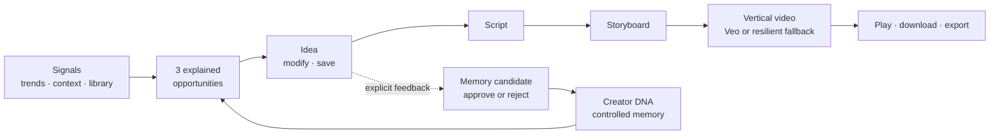
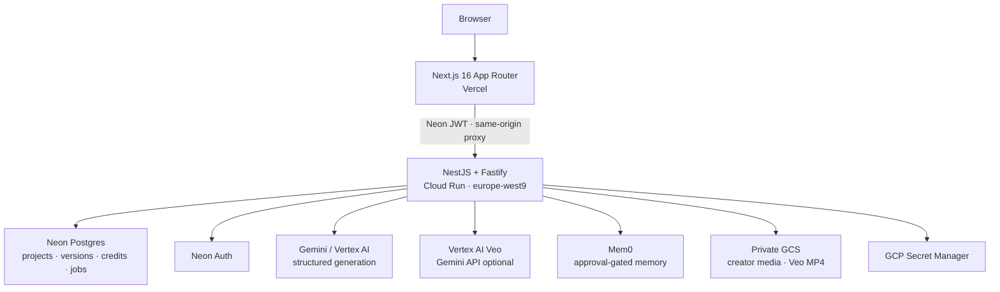

# Creonome

> Your creative operating system for turning signals, memory and instinct into a repeatable stream of vertical video content.

[Live product](https://www.creonome.com) · [API contract](https://creonome-api-909754432431.europe-west9.run.app/api/openapi.json) · [Product & technical bible](creonome_bible_produit_ux_ui_technique.md)

Creonome helps an independent music creator answer a deceptively hard question: **what should I make next, and how do I make it feel like me?** It combines live creative signals with a creator-controlled memory, explains why each opportunity fits, and turns the selected idea into a script, storyboard and playable vertical video.

This public repository is the end-to-end hackathon build: a production-deployed Next.js application, a NestJS/Fastify API on Cloud Run, Neon Postgres/Auth, Mem0, Gemini/Vertex structured generation and a resilient Veo video pipeline.

## The core product journey

1. **Sign in and establish Creator DNA.** Upload or describe representative work; Creonome extracts evidence-backed patterns that remain editable and reviewable.
2. **Open Today.** Three opportunities explain their signal, freshness, confidence and fit instead of presenting a black-box ranking.
3. **Choose an idea.** Modify it conversationally or save it while preserving version history and the creator's original intent.
4. **Generate deliverables.** Progress from Script → Storyboard → Video with explicit credit costs and non-blocking progress feedback.
5. **Inspect the memory loop.** Feedback is proposed as a memory candidate; the creator approves or rejects what Creonome may remember.

The result is not “AI that creates instead of you.” Creonome keeps the artist in the director's chair while removing the blank-page and production-planning bottlenecks.

## Product loop



## What is working

| Area                   | Current implementation                                                                    |
| ---------------------- | ----------------------------------------------------------------------------------------- |
| Authentication         | Neon Auth email/password and Sign in with Google                                          |
| Creator onboarding     | Private GCS uploads, multimodal analysis, editable evidence-backed Creator DNA            |
| Trend intelligence     | Normalized sources, candidates, snapshots and clusters attached to opportunity reasoning  |
| Today                  | Three explainable opportunities, multiple filters, incremental batches and card carousel  |
| Creative direction     | Conversational idea modification with version preservation                                |
| Production workflow    | Credited Script → Storyboard → Video project progression                                  |
| Video                  | Verified Vertex AI Veo 3.1 rendering, private GCS delivery and deterministic MP4 fallback |
| Memory                 | Mem0 adapter plus approval-gated memory candidate queue                                   |
| Credits                | Idempotent reserve / commit / release ledger; no charge for unusable output               |
| Library and export     | Tenant-scoped assets, confirmed source deletion and Markdown project package              |
| Privacy                | Persisted consent/retention controls, sanitized export, cancellable deletion request      |
| Themes and interaction | Responsive light/dark UI, route progress and non-blocking generation toasts               |

TikTok/Instagram connections and Stripe are intentionally marked **Coming soon**. They are outside the MVP rather than mocked as live integrations.

## Resilient video generation

`VIDEO_PROVIDER=auto` uses Vertex AI to generate a real 8-second, 720p, 9:16 Veo render from the latest script, storyboard and Creator DNA. This path has been verified end to end in the deployed product: the browser loaded the authenticated 720×1280 MP4 from the project after the API persisted its provider metadata and complete object in private GCS. Veo is a long-running operation, so the API polls with a controlled deadline and never exposes an incomplete result.

Any quota, permission, model, timeout, safety, incomplete-response, download or storage failure atomically selects the committed deterministic MP4. The UI reports the distinction honestly:

- **Video ready** — a validated Veo file was stored;
- **Video preview ready — generated with MVP fallback** — the deterministic preview kept the workflow usable.

Both variants play and download from the project. Credits are reserved once and committed once; they are released only if neither path can persist a usable result. See [the video rendering design](docs/architecture/video-rendering.md).

## Trend intelligence

The research handoff is integrated through the canonical Neon model rather than by coupling the web request path to fragile scraping scripts. A trend passes through `trend_sources` → `trend_candidates` → `trend_snapshots` → `trend_clusters`; the opportunity generator receives the strongest workspace clusters, and each persisted opportunity keeps the cluster that informed its momentum score and rationale.

The API response follows the handoff's degradation contract: keys never disappear, `status` drives the UI, unavailable evidence is explained instead of becoming a silent zero, and synthetic/authorized demo data is visibly labeled as sample data. Collection can evolve independently behind this boundary without changing the Today or opportunity-detail contracts.

## Architecture



The frontend never receives provider credentials or a private GCS URI. Real video playback uses a tenant-authorized, byte-range-aware API stream. Service-account JSON files are not used or committed.

## Monorepo map

```text
apps/web/             Next.js App Router product and authenticated BFF routes
apps/api/             NestJS/Fastify domain API and OpenAPI document
packages/contracts/   shared Zod request/response contracts
packages/config/      validated server environment schemas
packages/db/          Drizzle schema, migrations and deterministic demo seed
docs/                 setup, implementation and architecture notes
infra/gcp/            Cloud Build, Cloud Run environment and media CORS config
Screen catalog.../    complete Claude Design handoff retained for traceability
```

The API is organized by product boundaries (`opportunities`, `projects`, `credits`, `memory`, `privacy`, `uploads`) rather than by transport concerns. Provider adapters sit behind interfaces so deterministic and external implementations share the same workflow invariants.

## Run locally

Prerequisites: Node.js 22+, pnpm 10.25+, a Neon Postgres branch, and optional provider credentials.

```bash
git clone https://github.com/morganbblt/creonome.git
cd creonome
corepack enable
pnpm install --frozen-lockfile
cp .env.example .env
pnpm dev
```

At minimum, configure the Neon database/auth values described in [the environment guide](docs/setup/environment.md). Set `VIDEO_PROVIDER=deterministic` to run the complete video path locally without Veo access. Populated `.env` files, private keys and downloaded service-account credentials are ignored and must never be committed.

Default local endpoints:

- Web: `http://localhost:3000`
- API: `http://localhost:4000/api/v1`
- OpenAPI: `http://localhost:4000/api/openapi.json`

## Quality gates

```bash
pnpm format:check
pnpm lint
pnpm typecheck
pnpm test
pnpm build
pnpm audit --audit-level high
```

The suite covers shared contracts, domain services, tenant boundaries, idempotent credits, Veo success/failure modes, polling timeout, quota/permission fallback, incomplete responses, MP4 download validation, GCS verification, authenticated range delivery and the Storyboard → Video path.

## Security and privacy by design

- Secrets live in GCP Secret Manager or deployment environment stores; none use `NEXT_PUBLIC_`.
- Cloud Run uses `creonome-api@creonome.iam.gserviceaccount.com` and least-privilege bucket/model roles.
- GCS has uniform access and public-access prevention; generated Veo files are streamed only after workspace authorization.
- Every tenant query is scoped by the workspace resolved from the verified Neon bearer principal.
- OAuth platform credentials belong to future Creonome developer apps, never to end users; per-user tokens will be encrypted.
- Mem0 writes remain approval-gated, and privacy exports intentionally exclude secrets and internal provider errors.

## Deployment

- **Web:** Vercel from the public repository, production at [creonome.com](https://www.creonome.com).
- **API:** Cloud Build container deployed to Cloud Run `creonome-api` in Paris (`europe-west9`) with a 300-second request timeout.
- **Data/Auth:** Neon project `Creonome`.
- **Media:** private `gs://creonome-909754432431-media` bucket.

Deployment configuration is documented in [the environment guide](docs/setup/environment.md). A deploy is performed only after typecheck, tests, lint and build pass.

## Deliberate MVP boundaries

- Social OAuth, analytics ingestion and publishing for TikTok/Instagram;
- real billing and Stripe checkout (the credits/billing surface is intentionally synthetic);
- multi-clip video timeline editing beyond the current short Veo/fallback render;
- scheduled destructive retention workers (the preferences and cancellable request are already persisted);
- Lyria music generation while preview access and product fit are finalized.

## Product principles

The implementation follows the repository's [product, UX/UI and technical bible](creonome_bible_produit_ux_ui_technique.md): explainability before automation, creator control before silent memory, progressive disclosure before dashboard density, and an exploitable artifact before credit capture.

Creonome is built to create a lot of vertical video content—without making the creator feel replaceable.
