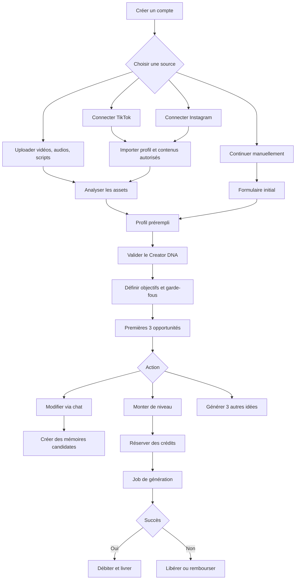
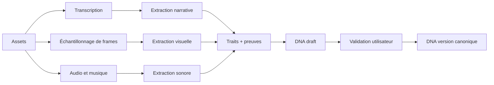
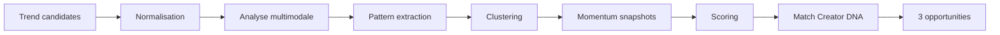
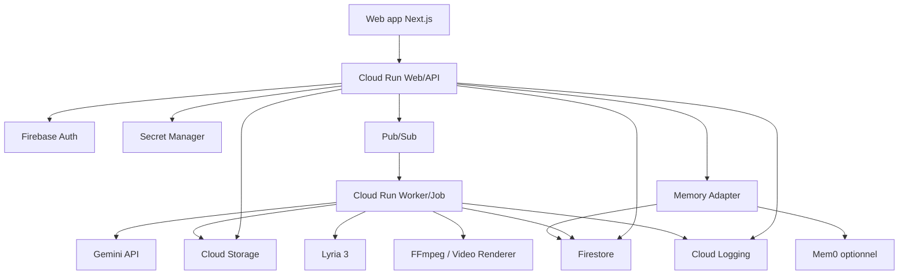

# Creonome — Bible produit, UX/UI et architecture technique

**Version :** 0.4  
**Date :** 1er août 2026  
**Statut :** document de référence pour le hackathon et le MVP  
**Nom du produit :** Creonome

---

## 0. Résumé exécutif

Creonome est une web app responsive qui transforme des signaux de tendances issus des vidéos verticales — TikTok, Instagram Reels et, à terme, YouTube Shorts — en contenus immédiatement exploitables et cohérents avec l’ADN d’un créateur.

En plus de « trouver tout ce qui est viral », la promesse utile et crédible est :

> **Présenter trois opportunités créatives bien choisies, expliquer pourquoi elles sont pertinentes pour ce créateur, puis les faire évoluer de l’idée jusqu’au contenu prêt à publier.**

Le produit repose sur quatre moteurs :

1. **Compréhension du créateur**  
   Connexion de comptes sociaux lorsque les API l’autorisent, import d’audios, vidéos, scripts et références, puis extraction d’une direction artistique, d’un ton, de structures narratives, de contraintes et de préférences.

2. **Intelligence de tendances**  
   Détection ou ingestion de patterns de formats, hooks, rythmes, sons, structures, sujets et signaux de momentum. Les tendances sont évaluées avec un score d’opportunité, une fraîcheur et un niveau de confiance.

3. **Génération progressive**  
   Chaque proposition existe comme un même objet qui monte en maturité :
   - Niveau 1 : idée
   - Niveau 2 : script
   - Niveau 3 : script + storyboard
   - Niveau 4 : vidéo prête à poster

4. **Mémoire créative**  
   Les échanges, modifications et décisions enrichissent progressivement l’ADN du créateur. La mémoire doit rester explicable, versionnée et contrôlable, et ne pas devenir une boîte noire qui modifie silencieusement l’identité du créateur.

Le cœur de l’UX n’est donc pas un dashboard analytique dense. C’est une **inbox créative focalisée sur trois cartes**, avec un bouton « + » pour demander trois nouvelles opportunités. Chaque action coûte un nombre de crédits connu à l’avance, et les crédits ne sont débités qu’en cas de résultat exploitable.

---

# 1. Synthèse des décisions issues des boards

## 1.1 Forme du produit

- Web app responsive, prioritairement pensée pour un usage desktop standard.
- Expérience mobile complète, mais non limitée à une esthétique de simple application mobile étirée.
- Interface simple, calme et très lisible.
- Une route principale qui présente trois propositions de tendances ou concepts.
- Pas d’infinite scroll au cœur de l’expérience.
- Un bouton « + » fait apparaître un nouveau lot de trois propositions.
- Une conversation contextualisée permet de modifier une proposition.
- Les échanges utiles enrichissent l’ADN du créateur.
- Une progression visible permet de faire évoluer chaque proposition du concept à la vidéo finale.

## 1.2 Onboarding

Ordre retenu :

1. Créer un compte ou rejoindre un workspace.
2. Choisir une ou plusieurs sources :
   - connecter TikTok ;
   - connecter Instagram pour importer des Reels lorsque le compte et les permissions le permettent ;
   - téléverser des vidéos, audios, scripts, images ou documents ;
   - continuer manuellement.
3. Laisser l’IA analyser les éléments importés.
4. Préremplir ensuite le formulaire créateur à partir de ce qui a été détecté.
5. Faire confirmer ou corriger le profil et la direction artistique.
6. Ajouter objectifs, audience, contraintes et sujets interdits.
7. Construire une première version de l’ADN créatif.
8. Générer les trois premières opportunités.

**Décision importante :** l’import ou la connexion précède le formulaire détaillé. Le produit doit d’abord travailler pour l’utilisateur, puis lui demander de corriger une synthèse, plutôt que lui imposer un long questionnaire à vide.

## 1.3 Niveaux de production

Chaque carte conserve son identité et son historique en montant de niveau :

| Niveau | Nom produit | Livrable principal |
|---|---|---|
| 1 | Idée | angle, hook, structure, justification et contraintes |
| 2 | Script | script timecodé, texte écran, CTA, indications de jeu |
| 3 | Storyboard | script + plans, cadrages, actions, assets et transitions |
| 4 | Prêt à poster | vidéo montée ou générée, sous-titres, musique et export |

## 1.4 Économie de crédits

Les crédits sont consommés principalement pour :

- générer un nouveau lot de concepts ;
- faire monter une proposition de niveau ;
- lancer des opérations média coûteuses ;
- produire des variantes image, musique ou vidéo.

Les corrections conversationnelles purement textuelles au même niveau doivent rester gratuites ou très largement incluses. Faire payer l’utilisateur pour corriger une mauvaise réponse ralentirait l’apprentissage de l’ADN et créerait une perception injuste.

---

# 2. Vision et positionnement

## 2.1 Vision

Permettre à chaque créateur de capter les bons signaux culturels sans perdre sa singularité.

## 2.2 Proposition de valeur

> Creonome détecte des opportunités de contenus verticaux, les adapte à l’identité créative d’un utilisateur et les transforme progressivement en scripts, storyboards ou vidéos prêtes à publier.

## 2.3 Différenciation

Le produit ne doit pas être présenté comme :

- une simple liste de tendances ;
- un chatbot généraliste avec un prompt TikTok ;
- un générateur de scripts génériques ;
- une promesse de viralité garantie ;
- un outil qui clone automatiquement un créateur.

Il doit être présenté comme la rencontre de trois actifs :

- **Trend Intelligence** : comprendre ce qui bouge et pourquoi ;
- **Creator DNA** : représenter l’identité, les préférences et les limites ;
- **Creative Production** : livrer un contenu actionnable et traçable.

## 2.4 North Star

**Nombre de contenus validés par le créateur et amenés à un niveau exploitable par semaine.**

La métrique n’est pas le nombre de générations. Une génération abandonnée n’est pas de la valeur.

## 2.5 Principes produit

1. **Trois choix forts valent mieux que trente suggestions moyennes.**
2. **Le produit explique ses recommandations.**
3. **Le score est une aide à la décision, pas une promesse de performance.**
4. **Le créateur reste directeur artistique.**
5. **La mémoire doit être contrôlable et réversible.**
6. **Les coûts sont affichés avant chaque action.**
7. **Les erreurs techniques ne consomment pas de crédits.**
8. **Une tendance est un pattern à adapter, pas un contenu à copier.**
9. **Le produit préfère les preuves et timecodes aux affirmations vagues.**
10. **Le niveau 4 peut être un montage intelligent d’assets réels, pas forcément une vidéo entièrement synthétique.**

---

# 3. Utilisateurs cibles et besoins

## 3.1 Persona principal — créateur indépendant

Profil :

- publie régulièrement sur TikTok ou Instagram ;
- possède déjà quelques vidéos représentatives ;
- manque de temps pour surveiller les tendances ;
- veut accélérer sa production sans devenir générique ;
- accepte l’assistance de l’IA, mais souhaite garder la validation finale.

Jobs to be done :

- « Aide-moi à savoir quoi publier cette semaine. »
- « Adapte cette tendance à mon style. »
- « Transforme cette idée en contenu tournable aujourd’hui. »
- « Souviens-toi de ce que j’aime et de ce que je refuse. »
- « Évite que je passe une heure à reformuler un prompt. »

## 3.2 Persona secondaire — social media manager

Besoins supplémentaires :

- plusieurs marques ou créateurs ;
- validation et commentaires ;
- historique et versioning ;
- crédits par workspace ;
- restrictions de marque ;
- comparaison de variantes ;
- export vers un outil de production.

## 3.3 Persona tertiaire — agence ou label

Besoins futurs :

- portefeuille de créateurs ;
- rôles et permissions ;
- budgets et quotas ;
- bibliothèques de marques ;
- reporting agrégé ;
- modèles d’approbation ;
- audit des contenus générés.

## 3.4 Anti-persona du MVP

Le MVP ne doit pas essayer de satisfaire immédiatement :

- les grandes entreprises ayant des workflows juridiques lourds ;
- les utilisateurs sans aucun asset, aucune niche et aucun objectif ;
- la veille exhaustive de toute une plateforme ;
- la publication automatisée sans validation humaine ;
- la génération massive de centaines de vidéos.

---

# 4. Modèle mental du produit

## 4.1 L’inbox créative

La page d’accueil est une **sélection quotidienne ou à la demande de trois cartes**.

Chaque carte représente une opportunité autonome, pas seulement une tendance brute. Une opportunité combine :

- un signal ou pattern observé ;
- un angle adapté au créateur ;
- une justification ;
- un niveau de production ;
- un score et sa confiance ;
- un coût pour la prochaine étape.

Les trois cartes doivent volontairement être diverses :

1. **Naturelle** — compatibilité élevée avec l’ADN existant.
2. **Émergente** — momentum élevé, légère prise de risque.
3. **Cross-sector** — pattern venu d’une autre niche, adapté au créateur.

Ces labels décrivent une stratégie, pas un classement.

## 4.2 Un objet qui monte en maturité

Une idée ne doit pas être recréée comme un nouvel objet à chaque niveau. Elle possède :

- un identifiant stable ;
- un historique de versions ;
- une conversation associée ;
- des décisions mémorisées ;
- des assets liés ;
- un état de production ;
- un coût cumulé ;
- un historique d’export et de publication.

## 4.3 Pas d’infinite scroll par défaut

Le bouton « + » génère trois nouvelles opportunités.

Pourquoi :

- limite la fatigue de décision ;
- rend la consommation de crédits compréhensible ;
- augmente la valeur perçue de chaque lot ;
- simplifie la mesure de la qualité ;
- favorise l’exploration intentionnelle.

Le produit peut proposer des filtres, mais ne doit pas devenir un mur de cartes.

---

# 5. User flow global



---

# 6. Onboarding détaillé

## 6.1 Objectifs UX

- Montrer de la valeur avant de demander beaucoup d’informations.
- Donner une alternative à chaque dépendance API.
- Rassurer sur l’usage des contenus.
- Rendre l’analyse progressive et compréhensible.
- Permettre de corriger facilement les inférences de l’IA.
- Atteindre la première génération en moins de dix minutes avec des fichiers déjà disponibles.

## 6.2 Étape 0 — Landing ou invitation

Éléments :

- promesse en une phrase ;
- aperçu de trois cartes ;
- CTA principal « Construire mon ADN créatif » ;
- CTA secondaire « Voir un exemple » ;
- information courte sur les contenus importés et la validation humaine.

Le hackathon peut ignorer une landing marketing complète et commencer par l’authentification.

## 6.3 Étape 1 — Authentification et workspace

Options :

- Google ;
- email ;
- lien magique si le délai le permet.

Champs :

- nom du créateur ou du workspace ;
- langue de l’interface ;
- fuseau horaire ;
- consentement aux conditions et à la politique de traitement des contenus.

## 6.4 Étape 2 — Choix des sources

Titre :

> Commençons par ce qui vous représente déjà.

Cartes de choix :

- **Connecter TikTok**
- **Connecter Instagram**
- **Importer mes contenus**
- **Continuer sans connexion**

Chaque carte explique précisément ce qui peut être récupéré.

### Correction de terminologie

Dans l’interface, il faut dire **« Connecter Instagram »**, pas « Connecter Reels ». Reels est un format de contenu. La connexion concerne un compte Instagram.

## 6.5 Étape 3 — Connexion TikTok

Flux :

1. Explication des permissions.
2. OAuth TikTok.
3. Retour dans l’application.
4. Import du profil et de la liste des vidéos autorisées.
5. Sélection par l’utilisateur des vidéos les plus représentatives.

Ce que le produit ne doit pas promettre :

- accès à toutes les tendances TikTok ;
- accès à tous les commentaires ou analytics sans permissions spécifiques ;
- accès universel aux vidéos d’autres créateurs.

Fallback :

- coller une URL ;
- uploader les fichiers ;
- importer une transcription ;
- utiliser un dataset de démo.

## 6.6 Étape 4 — Connexion Instagram

Flux :

1. Expliquer que l’accès complet dépend du type de compte et des autorisations.
2. OAuth Meta/Instagram.
3. Import des médias appartenant au compte lorsque l’API le permet.
4. Sélection des Reels représentatifs.
5. Import des insights disponibles.

Point de vigilance :

- les API de médias et insights sont surtout conçues pour les comptes professionnels et les médias appartenant au compte ;
- un compte personnel ou une autorisation refusée doit conduire immédiatement vers l’upload manuel.

## 6.7 Étape 5 — Upload d’assets

Formats utiles :

- vidéos : MP4, MOV, WebM ;
- audios : MP3, WAV, M4A ;
- images : PNG, JPG, WebP ;
- documents : PDF, TXT, DOCX si nécessaire ;
- scripts : texte collé ou fichier ;
- liens : URL de contenu public, lorsque l’usage est autorisé.

Zone d’upload :

- drag and drop ;
- progression par fichier ;
- miniature ;
- durée ;
- taille ;
- état ;
- bouton supprimer ;
- sélection « très représentatif » ;
- sélection « j’aime l’idée, mais ce n’est pas mon style ».

Demander au moins trois contenus représentatifs lorsque possible.

## 6.8 Étape 6 — Analyse en cours

Éviter le simple spinner.

Afficher une checklist progressive, inspirée d’une interface monochrome très lisible :

- contenus sécurisés ;
- audio transcrit ;
- hooks identifiés ;
- rythme et plans analysés ;
- vocabulaire et ton extraits ;
- direction visuelle synthétisée ;
- contraintes détectées ;
- profil prêt à être vérifié.

Chaque ligne peut passer de gris clair à noir ou accent, avec un check.

L’utilisateur peut quitter la page et recevoir une notification dans l’application à la fin.

## 6.9 Étape 7 — Profil prérempli

Le formulaire apparaît après l’analyse.

Sections :

### Identité

- nom ;
- bio courte ;
- niche principale ;
- niches adjacentes ;
- langue ;
- pays ou marché ;
- plateformes.

### Audience

- audience principale ;
- niveau de connaissance ;
- problèmes ;
- aspirations ;
- objections ;
- références culturelles.

### Objectifs

- croissance ;
- engagement ;
- conversion ;
- vente ;
- autorité ;
- communauté ;
- recrutement ;
- expérimentation créative.

### Contraintes

- durée maximale ;
- fréquence ;
- temps de tournage ;
- matériel ;
- présence face caméra ;
- voix off ;
- décors ;
- budget ;
- sujets interdits ;
- affirmations à éviter ;
- exigences légales ou de marque.

## 6.10 Étape 8 — Revue du Creator DNA

Présenter les traits sous forme de cartes modifiables :

- ton ;
- énergie ;
- vocabulaire ;
- humour ;
- structures narratives ;
- hooks ;
- rythme ;
- style de plans ;
- texte à l’écran ;
- musique ;
- palette ;
- CTA ;
- limites.

Chaque trait affiche :

- valeur ;
- niveau de confiance ;
- source ou preuve ;
- bouton corriger ;
- statut : déclaré, observé, appris ou interdit.

Exemple :

> **Hook préféré : démonstration immédiate**  
> Confiance : élevée  
> Preuves : 6 vidéos sur 8 commencent par un geste ou un résultat avant la troisième seconde.

## 6.11 Étape 9 — Calibration

Présenter six mini-propositions et demander :

- « Ça me ressemble »
- « J’aime, mais c’est une direction future »
- « À éviter »

Cette étape permet de distinguer :

- l’ADN actuel ;
- l’ADN souhaité ;
- les interdits.

## 6.12 Étape 10 — Résumé et première génération

Résumé compact :

- 8 à 12 traits clés ;
- objectifs ;
- limites ;
- sources connectées ;
- crédits disponibles ;
- temps estimé avant les trois premières propositions.

CTA :

> Générer mes trois premières opportunités

Ce premier lot devrait être inclus dans l’onboarding.

---

# 7. Page d’accueil et cartes de tendances

## 7.1 Structure desktop

### Barre latérale

Navigation primaire :

- Aujourd’hui
- Mes projets
- Bibliothèque
- Creator DNA

Navigation secondaire :

- Intégrations
- Crédits
- Réglages

La navigation doit rester courte. Les pages avancées peuvent être regroupées.

### En-tête

- salutation ou objectif du jour ;
- filtre plateforme ;
- filtre langue ou marché ;
- période ;
- compteur de crédits ;
- avatar ou workspace.

### Zone centrale

- trois cartes en grille ;
- un petit résumé de stratégie ;
- bouton « + Trois nouvelles idées » après les cartes ;
- historique du dernier lot dans une section repliée.

## 7.2 Structure mobile

- header compact ;
- crédits visibles ;
- une carte principale à la fois ou carrousel avec snap ;
- indication « 1 sur 3 » ;
- bottom navigation ;
- chat ouvert en plein écran ou bottom sheet ;
- CTA principal sticky en bas.

## 7.3 Anatomie d’une carte

### En-tête

- source ou famille de tendance ;
- badge de stratégie : Naturelle, Émergente, Cross-sector ;
- fraîcheur : « détectée il y a 2 jours » ;
- état : Idée, Script, Storyboard, Prêt à poster.

### Média

- vignette verticale ou assemblage ;
- couche légère de gradient ;
- éventuel aperçu de frames ;
- pas d’autoplay sonore.

### Contenu

- titre de l’idée ;
- pitch en deux phrases ;
- hook proposé ;
- raison principale de compatibilité ;
- durée recommandée ;
- effort estimé ;
- plateforme cible.

### Scoring

Afficher un score principal, par exemple :

> **86 / 100 — opportunité forte**

Puis trois sous-scores :

- momentum ;
- compatibilité ADN ;
- faisabilité.

Le détail s’ouvre dans un drawer.

### Actions

Primaire :

- « Passer au script »
- « Générer le storyboard »
- « Produire la vidéo »

Secondaires :

- « Modifier »
- « Voir pourquoi »
- « Enregistrer »
- menu : dupliquer, archiver, signaler un problème.

### Coût

Le coût est visible dans le CTA :

> Passer au script · 2 crédits

## 7.4 États de carte

- disponible ;
- enregistrée ;
- en modification ;
- génération en attente ;
- génération en cours ;
- résultat prêt ;
- erreur remboursée ;
- crédits insuffisants ;
- archivée ;
- expirée ou tendance refroidie.

## 7.5 Bouton « + »

Libellé recommandé :

> **3 nouvelles opportunités · 3 crédits**

Au clic :

1. afficher un mini-récapitulatif des filtres ;
2. permettre d’ajouter une instruction ;
3. montrer le coût ;
4. confirmer ;
5. remplacer le lot ou l’ajouter à l’historique.

Option utile :

- « Plus proche de mon ADN »
- « Plus expérimental »
- « Plus facile à tourner »
- « Axé conversion »

---

# 8. Scoring des tendances

## 8.1 Principe

Ne jamais afficher une « probabilité de viralité » comme une certitude. Le score doit mesurer une **opportunité relative** selon les données disponibles.

## 8.2 Score global proposé

```text
Score d’opportunité =
  22 % Momentum
+ 24 % Compatibilité ADN
+ 14 % Nouveauté / espace disponible
+ 12 % Potentiel de rétention
+ 10 % Portabilité cross-sector
+ 10 % Faisabilité de production
+  8 % Qualité des preuves
- pénalité de saturation
- pénalité de risque
```

Tous les sous-scores sont normalisés sur 100.

## 8.3 Sous-scores

### Momentum

Signaux possibles :

- croissance récente ;
- accélération plutôt que volume brut ;
- récence ;
- répétition du pattern sur plusieurs comptes ;
- présence sur plusieurs plateformes ;
- évolution du son ou du format.

### Compatibilité ADN

- ton ;
- structure ;
- niveau d’énergie ;
- style visuel ;
- contraintes ;
- audience ;
- objectifs ;
- formats déjà performants ;
- préférences déclarées.

### Nouveauté

- distance par rapport aux contenus récents ;
- faible redondance dans la niche ;
- place disponible avant saturation ;
- angle encore peu utilisé.

### Potentiel de rétention

- hook dans les premières secondes ;
- progression ;
- curiosité ;
- payoff ;
- boucle ;
- densité ;
- clarté visuelle.

Ce score reste une estimation fondée sur les patterns, pas une prédiction certaine.

### Portabilité cross-sector

- structure indépendante de la niche ;
- mécanisme narratif adaptable ;
- compatibilité culturelle ;
- risque de perdre le sens original.

### Faisabilité

- assets requis ;
- lieu ;
- nombre de plans ;
- personnes ;
- montage ;
- durée ;
- budget ;
- disponibilité des droits.

### Qualité des preuves

- nombre de contenus observés ;
- diversité des sources ;
- fraîcheur ;
- présence de timecodes ;
- disponibilité de métriques ;
- cohérence entre signaux.

## 8.4 Pénalités

### Saturation

- trop de copies récentes ;
- son arrivé en fin de cycle ;
- fatigue visible dans les commentaires ;
- déclinaison déjà utilisée par le créateur.

### Risque

- droits musicaux ;
- imitation trop proche ;
- sujet sensible ;
- claim non vérifié ;
- incompatibilité de marque ;
- présence d’une personne ou voix sans consentement.

## 8.5 Confiance et fraîcheur

Toujours afficher séparément :

- score ;
- confiance : faible, moyenne, élevée ;
- dernière mise à jour ;
- volume de preuves.

Exemple :

> 82 / 100 · confiance moyenne · 14 exemples · mis à jour il y a 6 h

## 8.6 Explicabilité

Le drawer « Pourquoi ce score ? » doit montrer :

- trois facteurs positifs ;
- deux réserves ;
- les exemples ou timecodes ;
- la différence entre le pattern et l’adaptation proposée.

---

# 9. Niveaux de génération

## 9.1 Niveau 1 — Idée

Livrable :

- titre ;
- objectif ;
- plateforme ;
- durée ;
- audience ;
- hook ;
- promesse ;
- déroulé en 4 à 6 étapes ;
- twist ou payoff ;
- CTA ;
- justification de tendance ;
- compatibilité ADN ;
- contraintes ;
- risques ;
- sources de référence.

Critère de réussite :

> Le créateur comprend le concept en moins de 30 secondes et sait s’il veut investir davantage.

## 9.2 Niveau 2 — Script

Livrable :

- texte parlé ;
- timecodes ;
- texte à l’écran ;
- intentions ;
- respirations ;
- CTA ;
- variantes de hook ;
- suggestions de son ;
- durée estimée ;
- mots à éviter ;
- instructions de tournage minimales.

Éditeur :

- structure par blocs ;
- lecture continue ;
- comparaison de versions ;
- sélection d’une phrase et demande de modification ;
- compteur de durée.

## 9.3 Niveau 3 — Script + storyboard

Livrable par scène :

- timecode ;
- cadrage ;
- action ;
- dialogue ;
- texte à l’écran ;
- B-roll ;
- transition ;
- asset requis ;
- son ;
- consigne de montage ;
- frame de référence optionnelle.

Vue :

- timeline horizontale sur desktop ;
- liste verticale sur mobile ;
- miniatures ;
- drag and drop ;
- ajout ou suppression de scène ;
- verrouillage d’une scène avant régénération.

## 9.4 Niveau 4 — Vidéo prête à poster

Deux modes distincts doivent être affichés honnêtement.

### Mode A — Assemblage intelligent

Le produit utilise :

- rushs du créateur ;
- images ou clips autorisés ;
- sous-titres ;
- musique ;
- voix off autorisée ;
- transitions ;
- branding ;
- montage automatique.

Avantages :

- coût inférieur ;
- meilleure authenticité ;
- plus réaliste pour le MVP ;
- moins de risques de ressemblance artificielle.

### Mode B — Génération média

Le produit génère certains plans ou toute la vidéo avec un modèle de génération vidéo.

Contraintes :

- coût variable ;
- délai plus long ;
- disponibilité et quotas ;
- cohérence de personnage ;
- droits ;
- nécessité d’une validation forte.

Le produit ne doit jamais laisser penser que le niveau 4 est toujours gratuit ou instantané.

## 9.5 États de génération

```text
draft
→ awaiting_credit_reservation
→ queued
→ analyzing
→ generating
→ assembling
→ quality_check
→ ready
```

États d’échec :

```text
failed_retryable
failed_final
cancelled
expired
refunded
```

## 9.6 Régénération partielle

L’utilisateur doit pouvoir verrouiller :

- le hook ;
- une scène ;
- le ton ;
- la durée ;
- les assets ;
- la musique ;
- le CTA.

Une régénération ne doit pas réécrire les parties verrouillées.

---

# 10. Modification par chatbot

## 10.1 Ouverture

Sur desktop :

- sheet à droite de 420 à 520 px ;
- la carte reste visible ;
- le contexte est déjà chargé.

Sur mobile :

- plein écran ou bottom sheet agrandie ;
- retour explicite à la carte ;
- CTA sticky.

## 10.2 Prompts rapides

- Plus court
- Plus drôle
- Plus premium
- Moins promotionnel
- Sans face caméra
- Plus facile à tourner
- Change le hook
- Adapte à Instagram
- Garde cette phrase
- Ne me propose plus ce type d’angle

## 10.3 Portée de la modification

À chaque instruction importante, proposer :

- **Pour cette idée uniquement**
- **Pour ce projet**
- **À retenir pour mes prochaines créations**

Cette distinction empêche une préférence ponctuelle de devenir une règle globale.

## 10.4 Enrichissement de la mémoire

Le chatbot peut créer une mémoire candidate :

> Le créateur préfère des CTA implicites et refuse les formulations « tu fais cette erreur ».

La mémoire candidate contient :

- le texte normalisé ;
- sa portée ;
- la source ;
- la confiance ;
- la date ;
- le projet ;
- les éventuelles preuves ;
- le statut.

Statuts :

- proposée ;
- acceptée ;
- auto-acceptée après plusieurs confirmations ;
- refusée ;
- expirée ;
- remplacée.

## 10.5 Feedback explicite

Actions rapides :

- « C’est moi »
- « Presque »
- « Pas mon style »
- « Bonne idée, mauvaise formulation »
- « Ne plus utiliser »
- « Toujours faire comme ça »

Ces actions produisent des signaux plus fiables qu’un simple like.

## 10.6 Politique de coût

Recommandation :

- modifications textuelles au même niveau : gratuites dans une limite raisonnable ;
- nouvelle variante complète : coût faible explicite ;
- nouvelle image, musique ou vidéo : coût affiché ;
- correction d’un bug ou résultat invalide : gratuite.

---

# 11. Creator DNA et mémoire

## 11.1 Quatre couches

### Déclaré

Ce que l’utilisateur a explicitement renseigné.

Exemples :

- je parle à des fondateurs ;
- je ne danse pas ;
- je ne veux pas de clickbait ;
- mes vidéos doivent durer moins de 45 secondes.

### Observé

Ce que le système extrait des contenus.

Exemples :

- moyenne de 2,2 secondes par plan ;
- hooks visuels fréquents ;
- ton conversationnel ;
- très peu de texte à l’écran.

### Appris

Ce qui ressort des feedbacks et performances.

Exemples :

- les scripts avec anecdote personnelle sont davantage validés ;
- l’utilisateur raccourcit presque toujours les CTA ;
- les formats de 30 secondes ont une meilleure complétion.

### Interdit ou protégé

Ce qui ne doit pas être contourné.

Exemples :

- sujets interdits ;
- claims réglementés ;
- personnes non autorisées ;
- mots bannis ;
- contraintes de marque ;
- absence de consentement pour la voix ou l’image.

## 11.2 Schéma suggéré

```json
{
  "creatorId": "creator_123",
  "version": 4,
  "identity": {
    "niches": ["design produit", "IA appliquée"],
    "languages": ["fr"],
    "markets": ["FR", "BE", "CH"]
  },
  "tone": {
    "direct": {"value": 0.82, "source": "observed", "confidence": 0.88},
    "humorous": {"value": 0.38, "source": "declared", "confidence": 1.0},
    "sensational": {"value": 0.08, "source": "forbidden", "confidence": 1.0}
  },
  "narrative": {
    "preferredHooks": ["demonstration", "contrarian_observation"],
    "avoidedHooks": ["false_urgency", "shaming"],
    "preferredStructures": ["problem_demo_solution", "before_after"]
  },
  "visual": {
    "faceCamera": true,
    "averageShotSeconds": 2.2,
    "onScreenText": "minimal",
    "cameraStyle": ["static", "handheld_light"],
    "palette": ["neutral", "cool_blue"]
  },
  "constraints": {
    "maxDurationSeconds": 45,
    "manualApprovalRequired": true,
    "noVoiceClone": true
  }
}
```

## 11.3 Canonical versus mémoire conversationnelle

La version canonique de l’ADN doit être structurée et versionnée dans la base principale.

Mem0 peut être utilisé pour :

- préférences conversationnelles ;
- rappels ;
- feedbacks ;
- récupération de souvenirs pertinents ;
- informations souples.

Mem0 ne doit pas être l’unique source de vérité de :

- la facturation ;
- les interdits ;
- les permissions ;
- les versions du profil ;
- les consentements ;
- les assets ;
- les scores.

## 11.4 Evidence-first

Chaque trait observé doit pouvoir pointer vers :

- une vidéo ;
- un timecode ;
- un script ;
- une interaction ;
- un événement de performance.

## 11.5 Versioning

Créer une version lorsque :

- l’utilisateur valide une revue majeure ;
- plusieurs nouvelles observations convergent ;
- une marque ou un projet change ;
- un interdit est ajouté ;
- une préférence durable est confirmée.

Fonctions :

- voir les changements ;
- restaurer une version ;
- comparer deux versions ;
- empêcher les mises à jour automatiques globales.

---

# 12. Système de crédits

## 12.1 Objectifs

- rendre les coûts compréhensibles ;
- contrôler le coût des modèles ;
- éviter les mauvaises surprises ;
- créer un modèle freemium simple ;
- ne pas pénaliser l’apprentissage du produit.

## 12.2 Exemple de grille initiale

Cette grille est une hypothèse produit à calibrer après mesure réelle des coûts.

| Action | Crédits indicatifs |
|---|---:|
| Premier lot de 3 idées | inclus |
| Nouveau lot de 3 idées | 3 |
| Idée → script | 2 |
| Script → storyboard | 4 |
| Variante de storyboard avec nouvelles images | 2 à 5 |
| Musique courte | 1 à 2 |
| Montage à partir de rushs | 8 à 15 |
| Vidéo majoritairement générée | estimation 20 à 60 |

## 12.3 Règles

- Afficher le coût avant l’action.
- Réserver les crédits au démarrage.
- Débiter à la réussite.
- Libérer ou rembourser en cas d’échec technique.
- Ne pas débiter deux fois lors d’un retry automatique.
- Donner un reçu détaillé dans l’historique.
- Ne jamais masquer le coût variable d’une vidéo.
- Permettre un plafond par génération.
- Prévenir avant solde faible.

## 12.4 Ledger

Chaque mouvement doit être immuable :

```json
{
  "ledgerId": "cl_987",
  "workspaceId": "ws_123",
  "type": "reservation",
  "amount": -4,
  "reason": "upgrade_to_storyboard",
  "projectId": "prj_456",
  "jobId": "job_789",
  "status": "committed",
  "createdAt": "2026-08-01T12:00:00Z"
}
```

Types :

- grant ;
- purchase ;
- reservation ;
- commit ;
- release ;
- refund ;
- adjustment ;
- expiration.

## 12.5 UX crédits

Le solde est visible mais discret :

> 18 crédits

Au survol ou clic :

- solde ;
- estimation de ce qui est possible ;
- historique ;
- acheter ou changer de plan.

En cas de crédits insuffisants :

- expliquer ce qui manque ;
- proposer un niveau moins coûteux ;
- permettre d’enregistrer le projet ;
- ne pas fermer brutalement le contexte.

---

# 13. Architecture de l’information

## 13.1 Navigation desktop

```text
Aujourd’hui
Mes projets
Bibliothèque
Creator DNA
────────────
Intégrations
Crédits
Réglages
```

## 13.2 Navigation mobile

Quatre onglets maximum :

- Aujourd’hui
- Projets
- Bibliothèque
- ADN

Les intégrations, crédits et réglages passent dans le profil.

## 13.3 Pages

### Aujourd’hui

- lot de trois opportunités ;
- filtres ;
- bouton plus ;
- historique court ;
- statut des jobs.

### Projets

- contenus sauvegardés ;
- niveau ;
- dernière modification ;
- statut ;
- plateforme ;
- recherche ;
- filtres.

### Bibliothèque

- uploads ;
- contenus connectés ;
- scripts ;
- brand assets ;
- musiques ;
- exports.

### Creator DNA

- résumé ;
- traits ;
- preuves ;
- mémoire ;
- versions ;
- garde-fous.

### Intégrations

- TikTok ;
- Instagram ;
- stockage ;
- publication future ;
- état des permissions ;
- date de synchronisation.

### Crédits

- solde ;
- consommation ;
- packs ;
- factures ;
- limites.

### Réglages

- workspace ;
- membres ;
- langue ;
- données ;
- confidentialité ;
- suppression ;
- notifications.

---

# 14. Inventaire des écrans

## 14.1 Authentification

1. Landing minimale
2. Inscription
3. Connexion
4. Invitation workspace
5. Mot de passe ou lien magique

## 14.2 Onboarding

6. Bienvenue
7. Choix des sources
8. Connexion TikTok
9. Connexion Instagram
10. Upload d’assets
11. Sélection des contenus représentatifs
12. Analyse progressive
13. Profil prérempli
14. Audience et objectifs
15. Contraintes et garde-fous
16. Revue Creator DNA
17. Calibration créative
18. Résumé
19. Génération du premier lot

## 14.3 Cœur du produit

20. Aujourd’hui — trois cartes
21. Nouveau lot — configuration
22. Nouveau lot — confirmation crédits
23. Détail d’une opportunité
24. Drawer du score
25. Chat de modification
26. Confirmation d’une mémoire candidate
27. Upgrade de niveau
28. Job en file
29. Job en cours
30. Résultat prêt
31. Échec et remboursement

## 14.4 Studio

32. Éditeur d’idée
33. Éditeur de script
34. Comparaison de hooks
35. Storyboard
36. Éditeur d’une scène
37. Sélection d’assets
38. Génération de musique
39. Montage ou vidéo générée
40. Preview verticale
41. Validation finale
42. Export
43. Publication assistée

## 14.5 Gestion

44. Liste des projets
45. Détail d’un projet
46. Historique de versions
47. Bibliothèque
48. Détail d’un asset
49. Creator DNA
50. Détail d’un trait et preuves
51. File de mémoires candidates
52. Historique ADN
53. Intégrations
54. Crédits
55. Historique du ledger
56. Plan et facturation
57. Réglages confidentialité
58. Export ou suppression de données

## 14.6 États transverses

- vide ;
- loading ;
- skeleton ;
- offline ;
- permission refusée ;
- token expiré ;
- analyse partielle ;
- contenu non supporté ;
- score peu fiable ;
- tendance refroidie ;
- crédits insuffisants ;
- quota fournisseur ;
- export échoué ;
- contenu bloqué pour droits ou sécurité.

---

# 15. Spécification UX des écrans clés

## 15.1 Aujourd’hui

### Desktop

- sidebar 240 px ;
- contenu max-width 1320 px ;
- header 64 à 72 px ;
- grille 3 colonnes ;
- cartes de hauteur cohérente ;
- bouton plus centré ou pleine largeur ;
- jobs récents dans une bande secondaire.

### Tablette

- sidebar condensée ;
- grille 2 colonnes puis une carte ;
- chat en sheet.

### Mobile

- carte pleine largeur ;
- scroll horizontal snap ou pile verticale ;
- CTA sticky ;
- filtre dans un sheet ;
- score dans un drawer bas.

## 15.2 Détail d’une opportunité

Zones :

- résumé et score ;
- inspiration et preuves ;
- adaptation proposée ;
- raisons de compatibilité ;
- niveau actuel ;
- historique ;
- CTA d’upgrade ;
- chat.

Ne pas mélanger tous les détails dans la carte de feed.

## 15.3 Script editor

- vue blocs et vue lecture ;
- timecodes ;
- barre d’actions sticky ;
- durée estimée ;
- sélection contextuelle ;
- versions ;
- commentaires ;
- verrouillage ;
- export texte.

## 15.4 Storyboard

- rail de scènes ;
- preview 9:16 ;
- panneau de propriétés ;
- assets ;
- état de chaque scène ;
- drag and drop ;
- régénération partielle ;
- mode liste sur mobile.

## 15.5 Vidéo

- player 9:16 ;
- timeline ;
- sous-titres ;
- piste musicale ;
- assets ;
- statut des droits ;
- safe zones TikTok/Reels ;
- export ;
- comparaison de versions.

---

# 16. Direction artistique et design system

## 16.1 Synthèse des inspirations fournies

Les références convergent vers une DA :

- très lisible ;
- typographique ;
- principalement monochrome ;
- généreuse en espace ;
- dotée de CTA noirs très francs ;
- construite avec de grandes cartes arrondies ;
- capable de fonctionner en light et dark ;
- enrichie de couches translucides et de profondeur ;
- utilisant la couleur surtout dans les médias, les états et quelques accents ;
- avec une progression exprimée par des checks ou des niveaux ;
- avec un effet de pile pour représenter des variantes ou des niveaux.

La UI ne doit pas copier une marque existante. Elle doit extraire ces principes.

## 16.2 Positionnement visuel

> **Editorial clarity + soft depth + generative media.**

La base Shadcn apporte la sobriété. La personnalité vient de :

- surfaces légèrement chaudes ;
- bleu brumeux ;
- accent lime très limité ;
- cartes média généreuses ;
- verres translucides seulement sur des éléments ciblés ;
- layers et superpositions sur les objets créatifs ;
- motion douce lors des upgrades.

## 16.3 Tokens recommandés

### Light

```css
:root {
  --background: 45 17% 97%;
  --foreground: 220 10% 10%;
  --card: 0 0% 100%;
  --card-foreground: 220 10% 10%;
  --popover: 0 0% 100%;
  --popover-foreground: 220 10% 10%;

  --primary: 220 10% 10%;
  --primary-foreground: 0 0% 100%;

  --secondary: 220 10% 94%;
  --secondary-foreground: 220 10% 16%;

  --muted: 220 10% 94%;
  --muted-foreground: 220 7% 45%;

  --accent: 195 34% 70%;
  --accent-foreground: 198 45% 18%;
  --signal: 68 63% 68%;

  --border: 220 9% 88%;
  --input: 220 9% 88%;
  --ring: 195 42% 55%;
  --destructive: 0 72% 55%;

  --radius-control: 0.875rem;
  --radius-card: 1.5rem;
  --radius-panel: 1.75rem;
}
```

### Dark

```css
.dark {
  --background: 222 8% 8%;
  --foreground: 40 10% 96%;
  --card: 222 7% 11%;
  --card-foreground: 40 10% 96%;
  --popover: 222 7% 11%;
  --popover-foreground: 40 10% 96%;

  --primary: 40 10% 96%;
  --primary-foreground: 220 10% 10%;

  --secondary: 222 6% 16%;
  --secondary-foreground: 40 10% 94%;

  --muted: 222 6% 16%;
  --muted-foreground: 220 7% 66%;

  --accent: 195 28% 48%;
  --accent-foreground: 195 30% 96%;
  --signal: 68 52% 58%;

  --border: 222 6% 22%;
  --input: 222 6% 22%;
  --ring: 195 38% 58%;
  --destructive: 0 65% 58%;
}
```

Ces valeurs sont un point de départ à tester en contraste.

## 16.4 Couleur

Règles :

- 80 % neutres ;
- 15 % médias ;
- 5 % accents fonctionnels ;
- noir ou blanc pour les CTA principaux ;
- bleu brumeux pour la sélection, le focus et la progression ;
- lime pour un signal rare : nouveau, forte compatibilité ou succès ;
- ne jamais coder le score uniquement par la couleur.

## 16.5 Typographie

Recommandation :

- Geist, Inter ou une sans système ;
- pas de police décorative au cœur du produit ;
- chiffres tabulaires pour crédits et scores.

Échelle :

| Token | Taille / ligne |
|---|---|
| Display | 48 / 52 |
| H1 | 36 / 42 |
| H2 | 28 / 34 |
| H3 | 22 / 28 |
| Body large | 18 / 28 |
| Body | 15 / 23 |
| Small | 13 / 19 |
| Micro | 11 / 16 |

## 16.6 Espacement

Échelle :

```text
4, 8, 12, 16, 20, 24, 32, 40, 48, 64, 80
```

- padding carte : 20 à 24 px ;
- gap grille : 20 à 24 px ;
- section : 40 à 64 px ;
- cible tactile : minimum 44 px.

## 16.7 Rayons

- inputs : 14 px ;
- boutons : 14 px ou pill ;
- cartes : 24 px ;
- grands panneaux : 28 px ;
- sheets : 28 px côté exposé ;
- badges : pill.

## 16.8 Ombres et verre

- ombres très douces ;
- bordures fines ;
- pas de glassmorphism partout ;
- verre réservé aux overlays, previews, palettes et cartes média premium ;
- blur entre 14 et 24 px ;
- toujours assurer la lisibilité sans blur.

## 16.9 Effet de pile

Utilisations :

- variantes d’un projet ;
- niveaux de maturité ;
- lot de trois concepts sur mobile ;
- historique ;
- bibliothèque média.

Ne pas empiler trois cartes interactives complètes sur desktop. La pile devient alors décorative et nuit à la lecture.

## 16.10 Motion

- 180 ms : hover, focus, contrôles ;
- 240 ms : drawer, sheet ;
- 320 ms : upgrade de niveau ;
- easing doux ;
- animation d’upgrade : les couches se déploient et révèlent le niveau suivant ;
- skeletons pour jobs courts ;
- checklist progressive pour analyses longues ;
- respecter `prefers-reduced-motion`.

## 16.11 Iconographie

- Lucide ;
- trait régulier ;
- taille 16, 20 ou 24 ;
- pas d’illustrations emoji disparates ;
- logos de plateformes uniquement selon leurs règles de marque.

---

# 17. Bibliothèque de composants

## 17.1 Primitives Shadcn

- Button
- Input
- Textarea
- Select
- Checkbox
- Radio Group
- Switch
- Tabs
- Badge
- Card
- Dialog
- Drawer
- Sheet
- Popover
- Tooltip
- Dropdown Menu
- Command
- Progress
- Skeleton
- Toast
- Alert
- Accordion
- Scroll Area
- Separator

## 17.2 Composants métier

- `TrendOpportunityCard`
- `OpportunityScore`
- `ScoreBreakdownDrawer`
- `MaturityLevelRail`
- `CreditCostBadge`
- `CreditBalance`
- `GenerateNextBatchButton`
- `CreatorDNAChip`
- `DNATraitCard`
- `MemoryCandidate`
- `SourceEvidence`
- `MediaUploadQueue`
- `AnalysisChecklist`
- `SocialConnectionCard`
- `GenerationJobCard`
- `ScriptBlock`
- `HookVariant`
- `StoryboardScene`
- `VerticalPreview`
- `AssetPicker`
- `RightsStatus`
- `VersionCompare`
- `ChatMemoryScope`
- `UpgradeConfirmation`
- `CreditReceipt`

## 17.3 Contrats de composants

Chaque composant métier doit avoir :

- état loading ;
- état vide ;
- état erreur ;
- accessibilité clavier ;
- dark mode ;
- mobile ;
- données longues ;
- score faible ;
- confiance faible ;
- droits bloquants.

---

# 18. Accessibilité

Objectif : WCAG 2.2 AA.

Exigences :

- contraste AA ;
- navigation clavier ;
- focus visible ;
- labels explicites ;
- erreurs liées aux champs ;
- alternatives textuelles pour médias ;
- transcription des audios ;
- sous-titres ;
- aucune information portée uniquement par la couleur ;
- cibles tactiles 44 × 44 px ;
- support du zoom 200 % ;
- motion réduite ;
- ordre de focus cohérent dans les sheets ;
- annonce ARIA des changements de job et de crédits ;
- confirmation avant actions coûteuses ou destructrices.

---

# 19. Réalité des intégrations sociales

## 19.1 TikTok

Le flux réaliste est :

- Login Kit pour l’authentification ;
- Display API pour le profil et les vidéos récentes ou sélectionnées ;
- scopes adaptés ;
- validation de l’application.

L’API Display expose notamment :

- informations basiques du profil ;
- liste de vidéos ;
- métadonnées de vidéos par identifiant.

Cela ne constitue pas une API générale de tendances. Pour le MVP, les tendances doivent provenir d’un dataset de démonstration, de sources autorisées, d’URLs fournies par l’utilisateur, de veille éditoriale ou de partenaires.

## 19.2 Instagram

La connexion concerne Instagram.

Le produit doit prévoir :

- les comptes professionnels ;
- les médias appartenant au compte ;
- les Reels et insights disponibles ;
- les permissions Meta ;
- le refus ou l’expiration des tokens ;
- l’upload manuel pour les comptes non compatibles.

## 19.3 Publication

La publication automatique est une phase ultérieure.

Pour le hackathon :

- export MP4 ;
- export script/storyboard ;
- copie de caption ;
- checklist safe zones ;
- bouton « télécharger et publier ».

## 19.4 Conformité

- ne pas construire le cœur du produit sur du scraping fragile ;
- respecter les conditions des plateformes ;
- stocker les tokens de manière chiffrée ;
- demander les permissions minimales ;
- permettre la déconnexion ;
- supprimer les données importées sur demande.

---

# 20. Pipeline IA

## 20.1 Gemini 3.5 Flash

Usage principal :

- comprendre vidéo et audio ;
- transcrire ou structurer le contenu ;
- décrire les scènes ;
- extraire hooks, rythme, narration et texte écran ;
- analyser scripts et documents ;
- générer des objets JSON ;
- produire idées et scripts.

Point technique :

- le modèle accepte texte, image, vidéo, audio et PDF en entrée ;
- il produit du texte, pas une vidéo ;
- il convient donc très bien au « video-to-structured-text ».

## 20.2 Lyria 3

Usage :

- musique courte ;
- ambiance ;
- instrumental ;
- musique guidée par une image ou une description ;
- version complète si besoin.

Le produit doit marquer Lyria 3 comme une fonction média payante et potentiellement preview. Ne pas supposer qu’elle entre dans le quota gratuit.

## 20.3 Vidéo complète

Architecture par adaptateur :

```ts
interface VideoRenderer {
  estimate(input: VideoRenderInput): Promise<CostEstimate>;
  render(input: VideoRenderInput): Promise<GenerationJob>;
  getStatus(jobId: string): Promise<GenerationStatus>;
  cancel(jobId: string): Promise<void>;
}
```

Implémentations possibles :

- assemblage FFmpeg ;
- service de génération vidéo Google ;
- autre fournisseur autorisé ;
- renderer de démo.

## 20.4 Pipeline d’analyse créateur



## 20.5 Pipeline de tendance



## 20.6 Pipeline de génération

Étapes séparées :

1. récupérer le contexte du créateur ;
2. récupérer les mémoires pertinentes ;
3. récupérer les preuves de tendance ;
4. créer un brief structuré ;
5. générer plusieurs candidats ;
6. scorer les candidats ;
7. éliminer les duplications ;
8. appliquer les garde-fous ;
9. sélectionner trois stratégies différentes ;
10. rendre le résultat ;
11. collecter le feedback.

Éviter un unique prompt géant.

## 20.7 Sorties structurées

Exiger des schémas JSON pour :

- analyse de média ;
- Creator DNA draft ;
- trend pattern ;
- score ;
- concept ;
- script ;
- storyboard ;
- mémoire candidate ;
- contrôle qualité.

## 20.8 Contrôle qualité

Vérifications automatiques :

- durée cohérente ;
- hook présent ;
- CTA conforme ;
- interdits respectés ;
- absence de copie textuelle trop proche ;
- assets disponibles ;
- claims signalés ;
- cohérence entre script et storyboard ;
- nombre de scènes ;
- format 9:16 ;
- safe zones.

---

# 21. Stack technique recommandée

## 21.1 Principe

Pour le hackathon, privilégier une stack courte, serverless et compatible avec les quotas gratuits. Ne pas introduire une architecture microservices complexe avant d’avoir un besoin réel.

## 21.2 Frontend

- Next.js App Router
- TypeScript
- React
- Tailwind CSS
- shadcn/ui
- Radix UI
- React Hook Form
- Zod
- TanStack Query pour les jobs
- Zustand uniquement pour l’état local complexe du studio
- `next-themes` pour light/dark
- Playwright pour les parcours critiques
- Vitest pour les fonctions

## 21.3 Hébergement

### Hackathon

- application Next.js sur Cloud Run ;
- mode request-based ;
- min instances à zéro ;
- CDN ou cache selon besoin ;
- domaine custom plus tard.

### Pourquoi Cloud Run

- déploiement conteneur ;
- scaling à zéro ;
- jobs ;
- free tier mensuel ;
- compatible avec FFmpeg ;
- cohérent avec le reste de GCP.

## 21.4 Authentification

- Firebase Authentication ;
- Google et email ;
- stockage du `uid` dans les documents ;
- OAuth TikTok et Meta gérés comme intégrations séparées ;
- Secret Manager pour les secrets.

## 21.5 Base de données

### MVP : Firestore

Raisons :

- quota gratuit adapté au hackathon ;
- intégration Firebase ;
- transactions ;
- temps réel ;
- vitesse de développement.

Limites :

- requêtes analytiques complexes ;
- joins ;
- reporting ;
- vector search selon coûts et disponibilité ;
- modèle de données à dénormaliser.

### Production : option PostgreSQL

Migrer ou ajouter Cloud SQL/AlloyDB lorsque :

- facturation complexe ;
- analytics relationnels ;
- recherches avancées ;
- nombreuses relations ;
- besoin d’extensions vectorielles.

Ne pas choisir Cloud SQL uniquement pour « tout mettre sur GCP gratuit » : son accès gratuit est surtout lié aux essais et crédits, pas à une base durable toujours gratuite.

## 21.6 Stockage

- Cloud Storage ;
- uploads directs via URL signée ;
- bucket privé ;
- lifecycle pour supprimer les fichiers temporaires ;
- thumbnails séparés ;
- assets originaux versionnés selon le besoin ;
- région choisie selon conformité et coût.

Le quota Always Free Cloud Storage est limité et dépend de régions américaines. Les vidéos dépassent vite quelques gigaoctets. Pour le hackathon :

- limiter la taille et la durée ;
- compresser ;
- supprimer les temporaires ;
- fournir des assets de démo.

## 21.7 Jobs asynchrones

- Pub/Sub pour les événements ;
- Cloud Run Jobs ou workers Cloud Run ;
- Cloud Tasks lorsque le contrôle de retry et de délai est nécessaire ;
- Firestore pour l’état visible ;
- idempotency key sur chaque job.

## 21.8 Analytics

### MVP

- événements dans Firestore ou Cloud Logging ;
- dashboard simple ;
- export éventuel.

### Plus tard

- BigQuery pour analytics produit et performance ;
- événements append-only ;
- vues de cohortes ;
- coût par contenu validé.

## 21.9 Mémoire

Créer une interface :

```ts
interface MemoryProvider {
  search(input: MemorySearchInput): Promise<Memory[]>;
  propose(input: MemoryProposalInput): Promise<MemoryCandidate>;
  approve(candidateId: string): Promise<Memory>;
  forget(memoryId: string): Promise<void>;
}
```

Implémentations :

- Firestore ;
- Mem0 ;
- hybride.

Cette abstraction évite une dépendance irréversible.

## 21.10 Média

- FFmpeg pour montage et extraction ;
- Cloud Run Job pour traitement ;
- Gemini 3.5 Flash pour analyse ;
- Lyria 3 pour musique ;
- renderer vidéo derrière feature flag ;
- Cloud Storage pour entrées et sorties.

## 21.11 Observabilité

- Cloud Logging ;
- Cloud Monitoring ;
- traces par `jobId` ;
- coûts par fournisseur ;
- latence par étape ;
- taux d’erreur ;
- alertes quota ;
- aucune donnée sensible brute dans les logs.

---

# 22. Architecture GCP proposée



## 22.1 Séparation des responsabilités

### Web/API

- auth ;
- validation ;
- CRUD ;
- création des jobs ;
- crédit reservation ;
- affichage de statut ;
- OAuth callbacks.

### Worker

- téléchargement d’assets ;
- extraction ;
- appels modèles ;
- assemblage ;
- contrôle qualité ;
- uploads résultats ;
- commit ou release des crédits.

### Firestore

- état canonique ;
- projets ;
- DNA ;
- jobs ;
- crédits ;
- intégrations ;
- index de bibliothèque.

### Cloud Storage

- média brut ;
- média dérivé ;
- exports ;
- assets temporaires.

---

# 23. Modèle de données

## 23.1 Collections principales

```text
users
workspaces
workspace_members
creator_profiles
creator_dna_versions
dna_traits
memory_candidates
social_connections
source_assets
asset_analyses
trend_sources
trend_candidates
trend_snapshots
trend_clusters
opportunities
projects
project_versions
scripts
storyboards
storyboard_scenes
generation_jobs
generated_assets
exports
credit_accounts
credit_ledger
feedback_events
audit_events
```

## 23.2 Opportunity

```json
{
  "id": "opp_123",
  "workspaceId": "ws_123",
  "creatorId": "creator_123",
  "trendClusterId": "trend_456",
  "strategy": "cross_sector",
  "title": "Le diagnostic en 3 gestes",
  "pitch": "Adapter un format de diagnostic express...",
  "currentLevel": "idea",
  "score": {
    "overall": 86,
    "momentum": 81,
    "dnaFit": 90,
    "novelty": 84,
    "feasibility": 88,
    "confidence": "medium",
    "updatedAt": "2026-08-01T09:00:00Z"
  },
  "status": "available",
  "createdAt": "2026-08-01T09:05:00Z"
}
```

## 23.3 Project version

Chaque modification significative crée une version :

```json
{
  "projectId": "prj_123",
  "version": 7,
  "level": "script",
  "parentVersion": 6,
  "changeSource": "chat",
  "changeSummary": "CTA rendu plus implicite",
  "lockedFields": ["hook"],
  "createdBy": "user_123",
  "createdAt": "2026-08-01T10:00:00Z"
}
```

## 23.4 Social connection

Ne jamais stocker les tokens en clair dans Firestore.

Champs :

- provider ;
- external account ID ;
- display name ;
- scopes ;
- status ;
- expires at ;
- last sync ;
- encrypted token reference ;
- failure reason ;
- consent version.

---

# 24. API interne

## 24.1 Uploads

```text
POST /api/uploads/sign
POST /api/assets
POST /api/assets/:id/analyze
GET  /api/assets/:id
DELETE /api/assets/:id
```

## 24.2 Onboarding et DNA

```text
POST /api/onboarding/analyze
GET  /api/creator-dna
POST /api/creator-dna/confirm
GET  /api/creator-dna/versions
POST /api/memory-candidates/:id/approve
POST /api/memory-candidates/:id/reject
```

## 24.3 Opportunités

```text
POST /api/opportunities/batches
GET  /api/opportunities
GET  /api/opportunities/:id
POST /api/opportunities/:id/save
POST /api/opportunities/:id/modify
POST /api/opportunities/:id/upgrade
```

## 24.4 Jobs

```text
GET  /api/jobs/:id
POST /api/jobs/:id/cancel
POST /api/jobs/:id/retry
```

## 24.5 Crédits

```text
GET  /api/credits
GET  /api/credits/ledger
POST /api/credits/estimate
POST /api/credits/purchase
```

## 24.6 Intégrations

```text
GET  /api/integrations
GET  /api/integrations/tiktok/start
GET  /api/integrations/tiktok/callback
GET  /api/integrations/instagram/start
GET  /api/integrations/instagram/callback
DELETE /api/integrations/:id
```

---

# 25. Sécurité, confidentialité et droits

## 25.1 Contenus privés

- buckets privés ;
- URLs signées courtes ;
- contrôle d’accès par workspace ;
- séparation des tenants ;
- suppression configurable ;
- politique de rétention ;
- export des données ;
- audit.

## 25.2 Clés

- aucune clé Gemini dans le navigateur ;
- Secret Manager ;
- rotation ;
- restrictions d’API ;
- service accounts avec permissions minimales.

## 25.3 Données et free tier Gemini

Le free tier peut avoir des conditions de traitement différentes du paid tier. Pour des contenus créateurs confidentiels, vérifier le cadre de traitement avant production et privilégier une configuration payante ou Vertex AI adaptée à la confidentialité.

## 25.4 Voix et image

- consentement explicite ;
- scope clair ;
- révocation ;
- pas de clone par défaut ;
- watermark ou disclosure selon le cas ;
- blocage pour personnes tierces non autorisées.

## 25.5 Musique

- afficher l’origine ;
- conserver les métadonnées ;
- ne pas garantir la disponibilité d’un son sur TikTok ou Instagram ;
- vérifier les droits de publication ;
- distinguer musique générée et audio tendance sous licence plateforme.

## 25.6 Copie

Le système doit extraire un pattern et générer une adaptation. Il doit éviter :

- reprise mot à mot ;
- imitation d’un créateur identifiable ;
- reproduction de plans trop proches ;
- réutilisation non autorisée d’un asset.

---

# 26. Metrics et analytics

## 26.1 Activation

- onboarding commencé ;
- au moins trois assets importés ;
- DNA confirmé ;
- premier lot généré ;
- première carte sauvegardée ;
- première carte montée au script.

## 26.2 Valeur

- taux de sauvegarde par lot ;
- taux d’upgrade ;
- temps jusqu’au premier script ;
- taux d’export ;
- taux de publication déclaré ;
- nombre de contenus validés par semaine.

## 26.3 Qualité

- « c’est moi » ;
- « pas mon style » ;
- nombre moyen de corrections avant validation ;
- taux de mémoire acceptée ;
- score de satisfaction ;
- abandon par niveau ;
- duplication entre lots.

## 26.4 Économie

- coût modèle par lot ;
- coût par script validé ;
- coût par export ;
- marge crédits ;
- taux de refund ;
- quota errors.

## 26.5 Performance contenu

Lorsque les données sont disponibles :

- vues ;
- watch time ;
- complétion ;
- rewatch ;
- partages ;
- sauvegardes ;
- commentaires ;
- clics ;
- conversions.

Ne pas optimiser uniquement les vues.

---

# 27. MVP hackathon

## 27.1 Périmètre recommandé

### Inclus

- auth simple ;
- onboarding avec upload ;
- simulation ou connexion sociale limitée ;
- analyse de 3 à 8 vidéos ;
- Creator DNA éditable ;
- trois opportunités ;
- score avec explication ;
- chat de modification ;
- mémoire candidate ;
- crédits simulés ou réels ;
- upgrade idée → script ;
- upgrade script → storyboard ;
- génération de 4 à 6 frames optionnelles ;
- export Markdown ou PDF ;
- un montage démo possible avec assets fournis.

### Feature flag

- connexion TikTok réelle ;
- connexion Instagram réelle ;
- musique Lyria ;
- vidéo générée ;
- publication.

### Hors scope

- veille exhaustive ;
- prédiction de viralité ;
- billing complet ;
- marketplace ;
- collaboration agence ;
- publication automatique ;
- génération massive.

## 27.2 Jeu de données de démo

Préparer :

- un créateur fictif ;
- huit vidéos représentatives ;
- vingt à trente vidéos de tendances autorisées ou synthétiques ;
- trois clusters ;
- métriques simulées clairement étiquetées ;
- un exemple de sortie à chaque niveau.

## 27.3 Démo idéale

1. Connexion.
2. Upload de trois vidéos.
3. Checklist d’analyse.
4. DNA prérempli.
5. Correction : « moins sensationnaliste ».
6. Arrivée sur trois cartes.
7. Ouverture du score.
8. Modification par chat : « sans face caméra ».
9. Choix « à retenir pour les prochaines créations ».
10. Upgrade vers script, avec coût.
11. Upgrade vers storyboard.
12. Preview d’un montage.
13. Historique crédits et mémoire.

## 27.4 Critère de réussite hackathon

Un jury doit comprendre en moins de deux minutes :

- d’où vient la tendance ;
- comment le produit comprend le créateur ;
- pourquoi l’idée lui correspond ;
- comment elle devient un livrable ;
- comment la mémoire s’améliore.

---

# 28. Roadmap

## Phase 0 — Hackathon

- workflow principal ;
- dataset ;
- upload ;
- Gemini ;
- DNA ;
- cartes ;
- score ;
- script ;
- storyboard ;
- crédits.

## Phase 1 — Alpha

- OAuth réels ;
- synchronisation ;
- projets ;
- bibliothèque ;
- versioning ;
- mémoire contrôlée ;
- analytics produit ;
- exports.

## Phase 2 — Production assistée

- rushs ;
- montage FFmpeg ;
- sous-titres ;
- musique ;
- voice-over autorisée ;
- templates ;
- commentaires ;
- publication assistée.

## Phase 3 — Boucle performance

- récupération d’insights ;
- comparaison prédiction/réel ;
- adaptation du score ;
- recommandations personnalisées ;
- calendrier éditorial.

## Phase 4 — Équipes

- workspaces ;
- rôles ;
- validation ;
- budgets ;
- brands ;
- multi-créateurs ;
- audit.

## Phase 5 — Média génératif avancé

- plans générés ;
- vidéo complète ;
- continuité visuelle ;
- traduction ;
- déclinaisons ;
- publication multicanal.

---

# 29. Risques et décisions

## 29.1 Dépendance aux APIs sociales

**Risque :** accès limité, validation lente, scopes changeants.  
**Décision :** l’upload manuel et le dataset restent des flux de premier rang.

## 29.2 Coût vidéo

**Risque :** impossible de tenir un vrai niveau 4 entièrement génératif dans un modèle purement gratuit.  
**Décision :** distinguer assemblage intelligent et génération complète ; afficher une estimation.

## 29.3 Qualité des tendances

**Risque :** un petit échantillon produit un score trompeur.  
**Décision :** afficher confiance, fraîcheur et qualité des preuves.

## 29.4 Mémoire incorrecte

**Risque :** une phrase ponctuelle modifie tout le profil.  
**Décision :** portée explicite, mémoires candidates, versioning et rollback.

## 29.5 Sur-génération

**Risque :** l’utilisateur consomme des crédits sans publier.  
**Décision :** optimiser le taux de validation, limiter à trois cartes et valoriser les upgrades.

## 29.6 Copie

**Risque :** adaptation trop proche d’un original.  
**Décision :** abstraction des patterns, contrôle de similarité, sources visibles et garde-fous.

## 29.7 « Tout gratuit sur GCP »

**Risque :** les quotas gratuits donnent une fausse impression de coût nul.  
**Décision :** utiliser Firestore, Cloud Run et quotas gratuits pour la démo, mais mesurer chaque appel média. Lyria et la génération vidéo peuvent être payantes même lorsque le backend tourne sur GCP.

---

# 30. Critères d’acceptation

## Onboarding

- l’utilisateur peut continuer sans réseau social ;
- les imports sont supprimables ;
- l’analyse montre une progression ;
- les champs sont préremplis ;
- chaque trait peut être corrigé ;
- la première valeur arrive rapidement.

## Feed

- exactement trois opportunités principales ;
- chaque carte montre niveau, score et coût ;
- les trois stratégies sont distinctes ;
- le bouton plus affiche le coût ;
- le score a un détail ;
- la fraîcheur est visible.

## Chat

- le contexte de la carte est conservé ;
- la portée de mémoire est choisissable ;
- le résultat modifié est versionné ;
- le chat n’efface pas les champs verrouillés.

## Credits

- coût visible ;
- réservation atomique ;
- absence de double débit ;
- remboursement d’échec ;
- historique lisible.

## Génération

- statut visible ;
- reprise ou retry ;
- sortie structurée ;
- niveau précédent conservé ;
- export fonctionnel.

## Responsive

- feed utilisable à 390 px ;
- chat utilisable au clavier mobile ;
- CTA sticky sans masquer le contenu ;
- storyboard converti en liste ;
- navigation limitée à quatre onglets.

---

# 31. Plan de construction en 48 heures

## Bloc 1 — Fondations

- repo ;
- Next.js ;
- shadcn ;
- tokens ;
- auth ;
- Firestore ;
- Cloud Storage ;
- schémas.

## Bloc 2 — Onboarding

- upload ;
- job d’analyse ;
- checklist ;
- DNA draft ;
- validation.

## Bloc 3 — Opportunités

- dataset ;
- scoring simple ;
- génération de trois cartes ;
- page principale.

## Bloc 4 — Studio

- chat ;
- mémoire candidate ;
- script ;
- storyboard ;
- versioning.

## Bloc 5 — Crédits et polish

- ledger ;
- confirmations ;
- erreurs ;
- responsive ;
- dark mode ;
- démo.

---

# 32. Copie UI indicative

## Onboarding

> Commençons par ce qui vous ressemble déjà.

> Importez quelques contenus. Nous préparerons votre profil créatif, puis vous pourrez tout corriger.

> Votre ADN n’est jamais figé. Chaque élément reste modifiable.

## Feed

> Trois opportunités pour aujourd’hui

> Sélectionnées selon votre ADN, vos objectifs et les signaux récents.

> 3 nouvelles opportunités · 3 crédits

## Score

> Un score d’opportunité, pas une promesse de viralité.

> Cette idée correspond fortement à votre ton, mais le format commence à se saturer.

## Chat

> Que souhaitez-vous changer ?

> Cette préférence s’applique-t-elle seulement à cette idée ou à vos prochaines créations ?

## Crédits

> 4 crédits seront réservés. Ils ne seront débités que si le storyboard est généré.

## Erreur

> La génération n’a pas abouti. Aucun crédit n’a été consommé.

---

# 33. Sources techniques officielles vérifiées

Informations vérifiées le 1er août 2026. Les modèles, prix, quotas et permissions peuvent évoluer ; ne pas les hardcoder sans contrôle.

- Gemini 3.5 Flash : https://ai.google.dev/gemini-api/docs/models/gemini-3.5-flash?hl=fr
- Compréhension vidéo Gemini : https://ai.google.dev/gemini-api/docs/video-understanding
- Tarification Gemini API : https://ai.google.dev/gemini-api/docs/pricing
- Lyria 3 : https://ai.google.dev/gemini-api/docs/music-generation?hl=fr
- TikTok Login Kit : https://developers.tiktok.com/doc/login-kit-web/
- TikTok Display API : https://developers.tiktok.com/doc/display-api-overview/
- Démarrage Display API : https://developers.tiktok.com/doc/display-api-get-started/
- Meta Instagram Platform : https://developers.facebook.com/docs/instagram-platform/
- Instagram Media : https://developers.facebook.com/docs/instagram-platform/reference/instagram-media/
- Instagram Insights : https://developers.facebook.com/docs/instagram-platform/reference/instagram-media/insights/
- Google Cloud Free Program : https://cloud.google.com/free
- Cloud Run pricing : https://cloud.google.com/run/pricing
- Firestore pricing : https://cloud.google.com/firestore/pricing
- Cloud Storage pricing : https://cloud.google.com/storage/pricing
- Firebase Authentication : https://firebase.google.com/docs/auth
- Mem0 : https://docs.mem0.ai/

---

# 34. Décision finale recommandée

Pour le hackathon, construire une expérience impeccablement démontrable autour de :

> **Upload → ADN prérempli → trois opportunités scorées → modification conversationnelle → script → storyboard → mémoire enrichie.**

La vidéo complète doit être présentée comme un niveau réel de la plateforme, mais implémentée soit par un montage d’assets autorisés, soit comme une démonstration sous feature flag. C’est plus crédible, moins coûteux et plus cohérent avec les quotas gratuits.

Le différenciateur le plus fort n’est pas la génération vidéo brute. C’est la continuité entre :

- la preuve de tendance ;
- l’ADN du créateur ;
- la recommandation ;
- la conversation ;
- la mémoire ;
- la production progressive.
