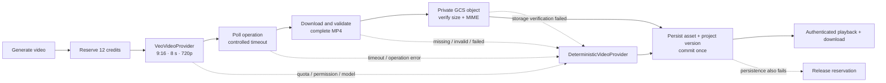

# Veo rendering with an atomic MVP fallback

Creonome treats a video as successful only after a complete MP4 has been validated, durably stored when generated by Veo, and persisted with its project version. Provider availability never blocks the hackathon workflow.

## Providers

- `VeoVideoProvider` builds a bounded prompt from the latest script, storyboard scenes, shot directions, scene timing, audio/edit notes and Creator DNA. It starts a Gemini API Veo operation, polls it, rejects incomplete results, downloads from the trusted Google API host, verifies the MP4 signature/MIME/size, and uploads the complete object to GCS.
- `DeterministicVideoProvider` returns the committed 9:16 demo MP4. It is deliberately permanent: it makes the full product loop demonstrable during quota, preview-model, permission, network or billing failures.
- `ResilientVideoProvider` owns provider selection and records only a stable error code such as `VEO_QUOTA`; raw provider responses, credentials and signed URLs never enter the API response.

The SDK abort signal stops the client request and local polling, but Google documents that it does not cancel the remote long-running operation. Creonome therefore enforces its own request deadline and never exposes a late or partial result.

## Storage and delivery

Real Veo files use `gs://creonome-909754432431-media/generated-videos/...` with uniform bucket-level access and public-access prevention. The persisted client URL points to `GET /api/v1/projects/:id/video`, which checks the Neon bearer principal, resolves the workspace, supports HTTP byte ranges, and streams from the private bucket. The Next.js same-origin proxy forwards authentication and range headers without buffering the file.

The deterministic MP4 remains a versioned public application asset. Both URLs support project playback and the Download action.

## Credit invariant

One idempotency key controls one reservation:

1. Reserve 12 credits before provider work.
2. Attempt Veo; use the deterministic result on any Veo failure.
3. Commit exactly once after the selected artifact and project version are persisted.
4. Release only when neither provider plus persistence can produce a usable result.

Retries first inspect the persisted idempotency key, preventing a second render or debit after a successful response was lost.

## Configuration

| Variable               | Default                                | Purpose                                      |
| ---------------------- | -------------------------------------- | -------------------------------------------- |
| `VIDEO_PROVIDER`       | `auto`                                 | `auto`, `veo`, or `deterministic` preference |
| `VEO_MODEL`            | `veo-3.1-fast-generate-preview`        | Gemini API video model                       |
| `VEO_POLL_INTERVAL_MS` | `10000`                                | Controlled operation polling interval        |
| `VEO_TIMEOUT_MS`       | `240000`                               | End-to-end provider deadline                 |
| `GEMINI_API_KEY`       | no default                             | Secret Manager-backed Gemini credential      |
| `GCP_MEDIA_BUCKET`     | no default in the validated API schema | Private durable video storage                |

`auto` and `veo` both keep the fallback. `deterministic` avoids any Veo request.
